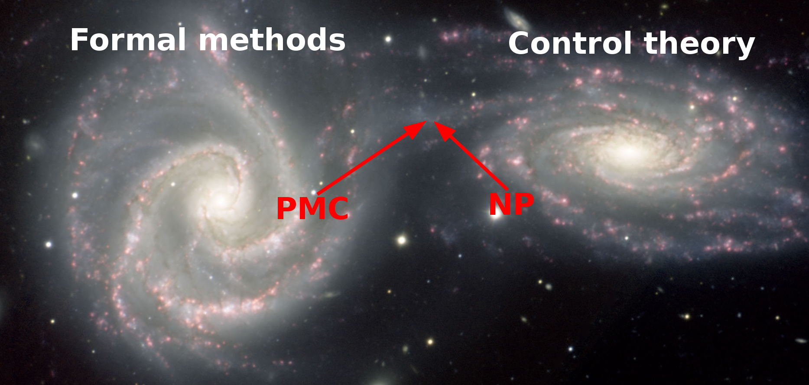

## From natural projection to partial model checking and back

__**Gabriele Costa**__, Letterio Galletta (IMT Lucca)

David Basin (ETH Zurich)

Chiara Bodei, Pierpaolo Degano (University of Pisa)

---
### Outline

- Problem statement
- Ongoing collision
- Partial model checking vs. natural projection
- Quotienting with PESTS
- Conclusion and future work

---
### Composition (A|B)

Given two transition systems A and B, their (parallel) composition has
- a state for each pair of A's and B's states
- an initial/final state for each pair of initial/final states
- *synchronous* transitions on common actions
- *asynchronous* transitions on the other actions

**Common in system modeling and analysis**

---

### Decomposition (A\B)

Given two transition systems A and B find X such that X|B = A

- \ a.k.a. **quotienting** operator
- Less common but relevant for problems on interest
- **Example:** Sub-module construction (SCP) and controller synthesis (CSP)
- *X could not exist*

**Hard to solve in general**

---

### Example: Drone Package Delivery

Unmanned aerial vehicles (UAV) operating on a docking station

- **Adder A$_n$** repeatedly puts down $n$ items (action $d$) and sends a synchronous signal (action $s$). Eventually terminates with a synchronous action $t$

- **Remover B$_n$** repeatedly picks up $n$ items (action $u$). Sync like A

- **Docking station P$_n$** has a limited, $n$-elements stack

---

### Example: Drone Package Delivery

**A$_2$**

**B$_1$**

---

### Example: Drone Package Delivery

**A$_2$ | B$_1$**

**P$_n$**

---

### Example: Drone Package Delivery

- Does A$_2$ | B$_1$ fulfil P$_2$ (in symbols A$_2$ | B$_1$ $\models$ P$_n$)?
 - No (e.g., $d d u s d d$)

- Given A, can we modify B to fulfil P? (SCP)

- Is there an agent C (controller) that enforces P on A | B? (CSP)

---

### Natural projection [Wonham]
$$\pi : 2^{\Sigma_0} \times \Sigma_0^\ast \rightarrow \Sigma_0^\ast$$

- Removes from a trace $\eta \in \Sigma_0^\ast$ the symbols belonging to $\Sigma \subseteq \Sigma_0$
 - **Example:** `$\pi_{\{b,g,u\}}(bungabunga) = nana$`
- Can be extended to a language $\mathcal{L} \subseteq \Sigma_0^\ast$
 - **Example:** `$\pi_{\{b,g,u\}}(bunga^\ast) = na^\ast$`
- Can be extended to finite state automata
---

### Partial model checking [Andersen]
$$// : \Phi \times \mathbb{A} \rightarrow \Phi$$
- Given a ($\mu$-calculus) formula $\phi$ and a transition system A find $\phi' = \phi // A$ such that for all B

A|B $\models \phi$  iff B $\models \phi'$

- Several applications in the formal methods community (e.g. program refinement and monitoring)

---

### NP vs. PMC

| | NP | PMC |
|---|---|---|
| Agent | FSA | LTS |
| Specification | FSA | $L_\mu$ |
| Complexity | EXPTIME* | EXPTIME |
| Tools | TCT, IDES3, DESTool | mCRL2, CADP, MuDiv |

*: PTIME for a specific class of FSA

---

### Gravitational waves

**Control theory** and **formal methods** are colliding [Ehlers et al.]

---

### A common framework (1)

- We redefine NP to work with LTS agents and $L_\mu$ specifications
 - Finite LTS $\sim$ FSA (with all accepting states)
 - Any FSA can be encoded as a `$L_\mu$` formula `\Phi` 
- A trace $\sigma$ is an alternation of state and action symbols
 - **Example:** A does $q_0 d q_1 d q_2$ (rather than $d d$)

---

### A common framework (2)

Given LTSs $A$ and $B$ with $\Gamma = \Sigma_A \cap \Sigma_B$, the **natural projection** on $A$ of a trace $\sigma$ is

- `$\pi_{A}(\langle s_A, s_B \rangle) = s_A$`
- `$\pi_{A}(\langle s_A, s_B \rangle a \langle s'_A, s'_B \rangle \cdot \sigma) = s_A a s'_A \cdot \pi_{A}({\sigma})$`
 - if $a \in \Sigma_A$
- `$\pi_{A}(\langle s_A, s_B \rangle b \langle s_A, s'_B \rangle \cdot \sigma) = \pi_{A}({\sigma})$`
 - if $b \in \Sigma_B \setminus \Gamma$

---

### Encoding NP as PMC

- **Theorem:** NP and PMC are equivalent

- **Theorem:** A | B `$\models$ \Phi` iff ...

---

### Conclusion

---

### References

- [Andersen] H. R. Andersen, Partial model checking, 1999
- [Wonham] W. M. Wonham, Supervisory control of discrete-event systems, (online) 2017
- [Ehlers et al.] R. Ehlers, S. Lafortune, S. Tripakis, M. Vardi. Bridging
the Gap between Supervisory Control and Reactive Synthesis: Case of Full Observation and Centralized Control, 2014
